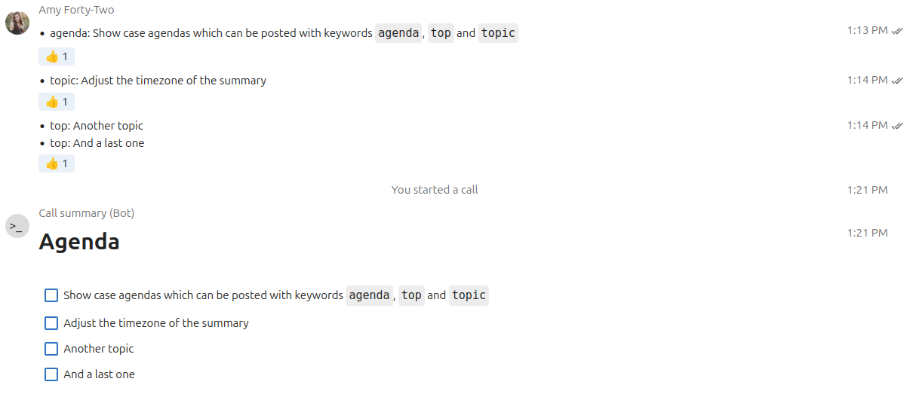
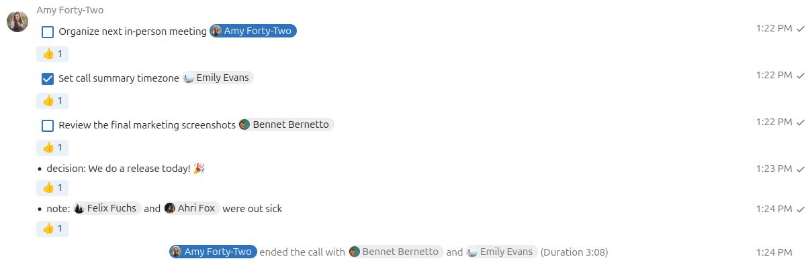
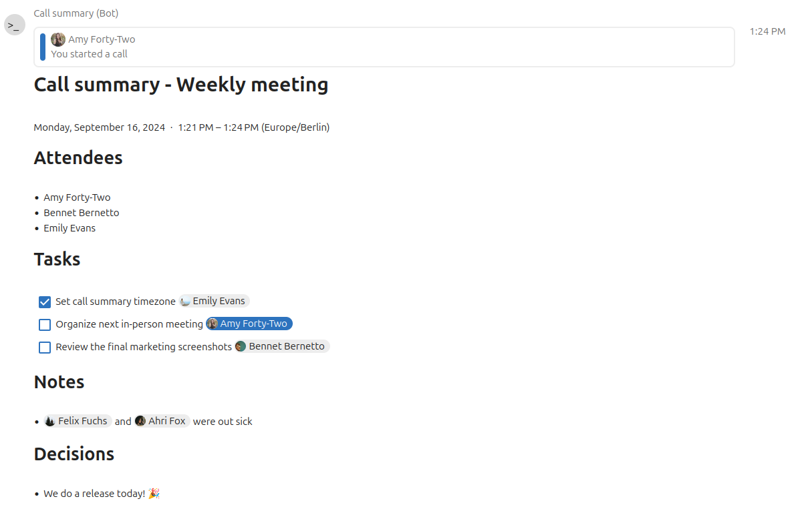

# Call Summary Bot

The call summary bot posts an overview message after the call listing all participants and outlining tasks

## Usage

### Before a call

- The bot can be used to also collect agenda points and topics with the following keywords:
  - `- agenda`
  - `- topic`
  - `- top`
- You can also post multiple tasks in a single message, just put each on its own line starting with a keyword



### During a call

- Any message starting with a Markdown checkbox or a keyword during a call will be recognized and used in the summary:
  - Open todos: `- [ ]`, `- todo:`, `- task:`
  - Solved todos: `- [x]`
  - Notes: `- note:`
  - Reports: `- report:`
  - Decisions: `- decision:`
- You can also post multiple tasks in a single message, just put each on its own line starting with a keyword
- At the end of the call, the bot will summarize it and list all the attendees as well as the tasks in a markdown chat message



> [!TIP]
> By default, the call summary will use UTC timezone for dates and times, as it has to be the same for all users at the moment.
> If most of your users are from the same timezone, you can set a default timezone:
> ```shell
> sudo -u www-data php occ config:app:set 'call_summary_bot' 'timezone' --value 'Europe/Berlin'
> ```



## Installation

Since this bot is written as a Nextcloud app, simply search for "Call summary bot" in the app list of your Nextcloud server, or download it manually from the [App store](https://apps.nextcloud.com/apps/call_summary_bot)

> [!NOTE]
> By default, only calls lasting at least 60 seconds are summarized. For easier quick testing this can be reduced to 0 seconds with the following command:
> ```shell
> sudo -u www-data php occ config:app:set 'call_summary_bot' 'min-length' --value '0'
> ```
